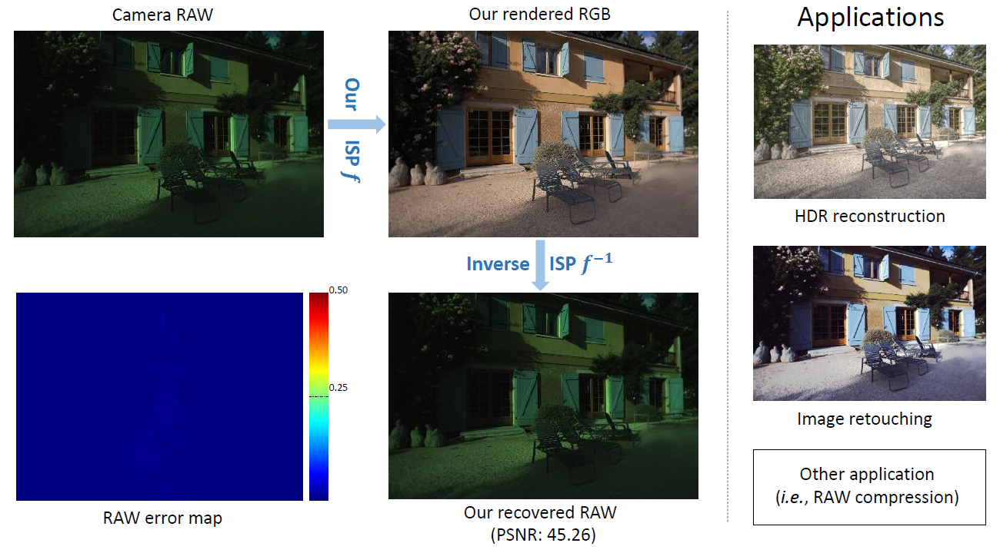

# Invertible Image Signal Processing


**This repository includes original and extent codes for "[Invertible Image Signal Processing (CVPR2021)](https://arxiv.org/abs/2103.15061)".** 




## Citation

```
@inproceedings{xing21invertible,
  title     = {Invertible Image Signal Processing},
  author    = {Xing, Yazhou and Qian, Zian and Chen, Qifeng},
  booktitle = {CVPR},
  year      = {2021}
}
```
## Acknowledgement
Part of the codes benefit from [DiffJPEG](https://github.com/mlomnitz/DiffJPEG) and [Invertible-Image-Rescaling](https://github.com/pkuxmq/Invertible-Image-Rescaling). 
